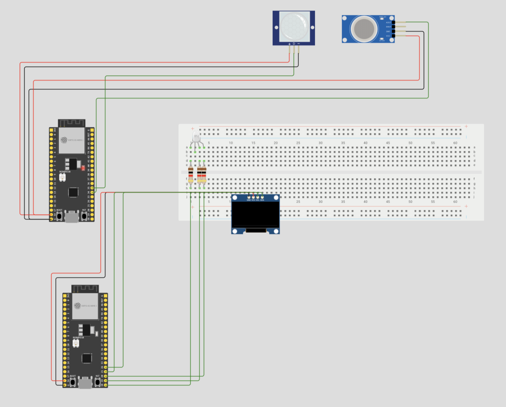
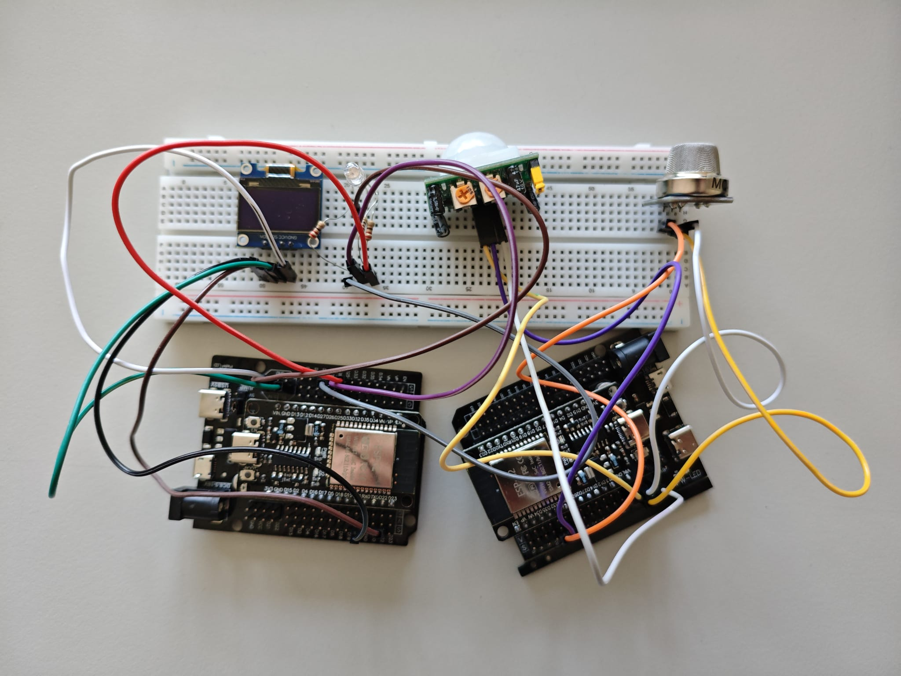
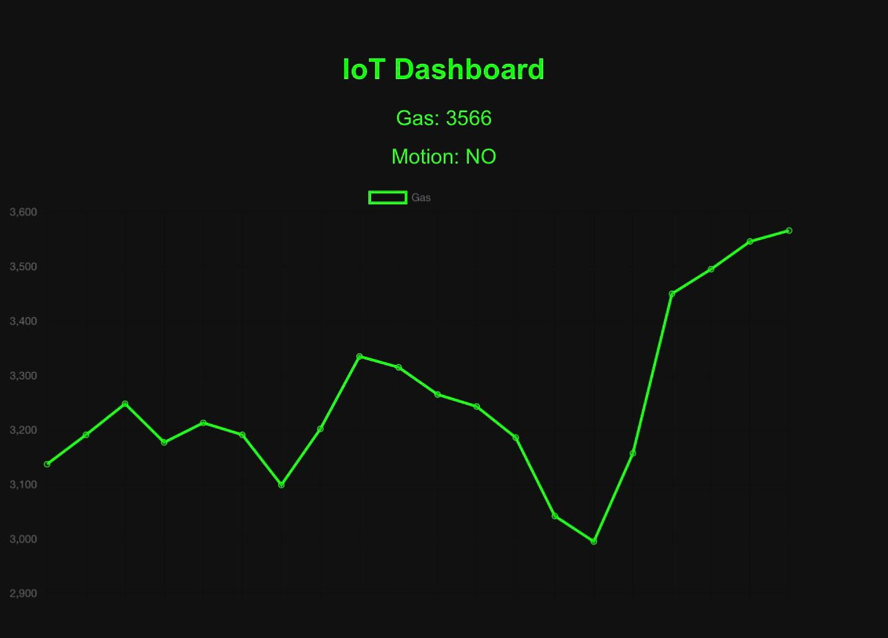
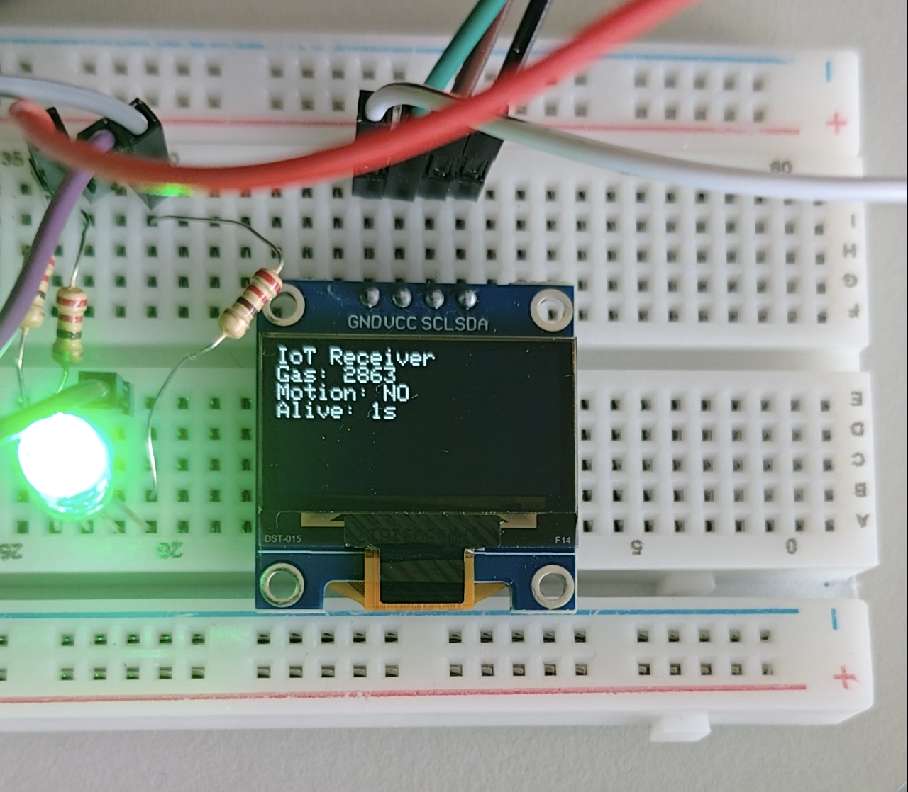

# IoT - Projekt

## Gas- und Bewegungserkennung 

Verfasser: **Nazar Tymoshenko, David Zachenegger**  
Datum: **26.05.2026**

---

## 1. Einführung

Im Rahmen dieses Projekts wird ein IoT-System auf Basis von ESP32-Mikrocontrollern entwickelt, welches Gas- und Bewegungsdaten erfasst, drahtlos über ESP-NOW überträgt und anschließend visualisiert. Dabei wird ein lokales Überwachungssystem realisiert, das unabhängig von einem Internetrouter funktioniert.

Die erfassten Sensordaten werden in Echtzeit auf einem Webinterface sowie auf einem OLED-Display dargestellt und können optional in einer Datenbank gespeichert werden. Ziel ist die Umsetzung einer stabilen IoT-Kommunikation sowie einer verständlichen Echtzeit-Datenvisualisierung.

---

## 2. Projektbeschreibung

Es wurde ein IoT-System mit zwei ESP32-Modulen realisiert, welches Gas- und Bewegungsdaten über Sensoren erfasst und drahtlos über ESP-NOW überträgt. Die Daten werden am Empfänger verarbeitet, visualisiert und in Echtzeit über ein Web-Dashboard dargestellt.

Zusätzlich erfolgt eine lokale Anzeige über ein OLED-Display sowie eine LED-Statusanzeige. Optional können die Messwerte in einer MySQL-Datenbank gespeichert und für spätere Analysen verwendet werden.

---

## 3. Theorie

#### ESP32

Der ESP32 ist ein Mikrocontroller mit integrierter WLAN- und Bluetooth-Funktion. Er wird in IoT-Anwendungen eingesetzt, da er analoge und digitale Sensoren auslesen und gleichzeitig Netzwerkkommunikation durchführen kann.

#### ESP-NOW

ESP-NOW ist ein von Espressif entwickeltes Kommunikationsprotokoll, das eine direkte Peer-to-Peer-Kommunikation zwischen ESP-Geräten ermöglicht. Dabei wird kein WLAN-Router benötigt. Die Kommunikation erfolgt über MAC-Adressen und ist sehr energieeffizient sowie latenzarm.

#### PIR-Bewegungssensor

Der PIR-Sensor (Passive Infrared Sensor) erkennt Bewegungen durch Änderungen der Infrarotstrahlung im Umfeld. Sobald eine Wärmeänderung erkannt wird, wird ein digitales Signal ausgegeben.

#### MQ-Gassensor

Der MQ-Gassensor misst Gaswerte über eine Änderung des elektrischen Widerstands. Je nach Gaskonzentration verändert sich der analoge Spannungswert, welcher vom ESP32 ausgelesen wird.

#### Webserver auf ESP32

Der ESP32 kann einen eigenen Webserver hosten, welcher über einen Access Point erreichbar ist. Dadurch können Sensordaten in einem Browser dargestellt werden.

---

## 4. Arbeitsschritte

#### 4.1 Hardwareaufbau

Zuerst wurde der ESP32 mit folgenden Sensoren verbunden:

- MQ-Gassensor → analoger Pin GPIO 34
- PIR-Bewegungssensor → digitaler Pin GPIO 32

Zusätzlich wurden folgende Komponenten angeschlossen:

- OLED Display (I2C)
- RGB-LED zur Statusanzeige





#### 4.2 ESP-NOW Verbindung

Ein ESP32 wurde als Sender und ein zweiter als Empfänger konfiguriert. Beide Geräte wurden über ihre MAC-Adresse gekoppelt.

Der Sender:

- liest Sensordaten aus
- speichert sie in einer Struktur
- sendet sie alle 1.5 Sekunden an den Empfänger

#### 4.3 Webserver

Der Empfänger erstellt einen eigenen WLAN-Access-Point („IoT_Station“). Über diesen kann eine Webseite im Browser aufgerufen werden.

Die Webseite zeigt:

- aktuelle Gaswerte
- Bewegungsstatus
- ein Live-Diagramm (Chart.js)



#### 4.4 Datenverarbeitung

Die empfangenen Daten werden:

- im RAM gespeichert
- auf OLED angezeigt
- im Webserver bereitgestellt
- optional an eine Datenbank gesendet



#### 4.5 Systemtest

Das System wurde getestet, indem:

- Bewegungen ausgelöst wurden
- Gaswerte verändert wurden
- Verbindungsausfälle simuliert wurden

Dabei wurde geprüft, ob:

- Daten korrekt übertragen werden
- Anzeige aktualisiert wird
- Status-LED korrekt reagiert

#### 4.6 Erweiterungsmöglichkeiten

Das System kann später durch eine Datenbankanbindung, Cloud-Integration oder mobile App erweitert werden.

---

## Sender (ESP32)

```cpp
#include <WiFi.h>
#include <esp_now.h>

// ===== Sensor Pins ===== //
#define GAS_PIN     34   // Analog-Eingang für Gassensor
#define MOTION_PIN  32   // Digitaler Eingang für PIR Sensor

// ===== MAC-Adresse des Empfängers ===== //
uint8_t receiverMac[] = {0x00,0x70,0x07,0x1C,0xED,0xED};

// ===== Datenstruktur für Übertragung ===== //
typedef struct SensorData {
  int gas;        // Gaswert (analog)
  bool motion;    // Bewegung erkannt (true/false)
} SensorData;

SensorData data;

// ===== Callback nach dem Senden ===== //
void onSend(const wifi_tx_info_t *info, esp_now_send_status_t status) {
  Serial.print("Send Status: ");
  Serial.println(status == ESP_NOW_SEND_SUCCESS ? "OK" : "FAIL");
}

// ===== Setup ===== //
void setup() {
  Serial.begin(115200);

  // Sensor Pins definieren
  pinMode(GAS_PIN, INPUT);
  pinMode(MOTION_PIN, INPUT);

  // ESP32 als WLAN Station (not AP)
  WiFi.mode(WIFI_STA);
  WiFi.disconnect();

  // ESP-NOW starten
  if (esp_now_init() != ESP_OK) {
    Serial.println("ESP-NOW Init fehlgeschlagen");
    return;
  }

  // Callback registrieren 
  esp_now_register_send_cb(onSend);

  // Empfänger hinzufügen
  esp_now_peer_info_t peerInfo = {};
  memcpy(peerInfo.peer_addr, receiverMac, 6);
  peerInfo.channel = 0;      // Auto Channel
  peerInfo.encrypt = false;  // keine Verschlüsselung

  if (esp_now_add_peer(&peerInfo) != ESP_OK) {
    Serial.println("Peer konnte nicht hinzugefügt werden");
    return;
  }

  Serial.println("Sender bereit");
}

// ===== Loop ===== //
void loop() {
  // Sensorwerte auslesen
  data.gas = analogRead(GAS_PIN);       // Gaswert einlesen
  data.motion = digitalRead(MOTION_PIN); // Bewegung lesen

  // Daten an Empfänger senden
  esp_now_send(receiverMac, (uint8_t *)&data, sizeof(data));

  delay(1500); // Pause zur Stabilisierung
}
```
Die Sensordaten werden kontinuierlich vom Sender ausgelesen, in einer Datenstruktur gespeichert und anschließend über das ESP-NOW-Protokoll an den Empfänger übertragen.

---

## Empfänger (ESP32)

```cpp
#include <WiFi.h>
#include <esp_now.h>
#include <WebServer.h>
#include <Wire.h>
#include <Adafruit_GFX.h>
#include <Adafruit_SSD1306.h>

// ===== OLED Display Setup ===== //
#define SCREEN_WIDTH 128
#define SCREEN_HEIGHT 64
Adafruit_SSD1306 display(SCREEN_WIDTH, SCREEN_HEIGHT, &Wire, -1);

// ===== RGB LED Pins ===== //
#define LED_R 25
#define LED_G 26
#define LED_B 27

// ===== Datenstruktur (muss identisch zum Sender sein) ===== //
typedef struct {
  int gas;       // Gaswert
  bool motion;   // Bewegung
} SensorData;

SensorData incoming;       // gespeicherte Daten
unsigned long lastPacket = 0; // Zeit des letzten Empfangs

// ===== Webserver ===== //
WebServer server(80);

// ===== LED Steuerung ===== //
void setColor(bool r, bool g, bool b) {
  digitalWrite(LED_R, r);
  digitalWrite(LED_G, g);
  digitalWrite(LED_B, b);
}

// ===== ESP-NOW Empfang ===== //
void onReceive(const esp_now_recv_info*, const uint8_t *data, int len) {
  // Prüfen ob richtige Datenlänge ankommt
  if (len == sizeof(SensorData)) {
    memcpy(&incoming, data, sizeof(incoming)); // Daten kopieren
    lastPacket = millis(); // Zeit speichern
  }
}

// ===== OLED Anzeige ===== //
void updateDisplay() {
  display.clearDisplay();
  display.setCursor(0, 0);
  display.setTextSize(1);
  display.setTextColor(SSD1306_WHITE);

  display.println("IoT Receiver");

  display.print("Gas: ");
  display.println(incoming.gas);

  display.print("Motion: ");
  display.println(incoming.motion ? "YES" : "NO");

  display.print("Last: ");
  display.print((millis() - lastPacket) / 1000);
  display.println(" s");

  display.display();
}

// ===== API für Webserver ===== //
void handleAPI() {
  server.sendHeader("Access-Control-Allow-Origin", "*");

  // JSON Ausgabe für Website
  server.send(200, "application/json",
    "{ \"gas\": " + String(incoming.gas) +
    ", \"motion\": " + String(incoming.motion ? "true" : "false") + " }"
  );
}

// ===== HTML Webseite ===== //
void handleRoot() {
  server.sendHeader("Cache-Control", "no-store");

  String html = R"rawliteral(
<!DOCTYPE html>
<html>
<head>
<meta charset="UTF-8">
<title>IoT Dashboard</title>
<script src="https://cdn.jsdelivr.net/npm/chart.js"></script>

<style>
body { background:#111; color:#0f0; font-family:Arial; text-align:center; }
canvas { max-width:90%; }
</style>
</head>

<body>
<h1>IoT Dashboard</h1>

<p id="gas">Gas: --</p>
<p id="motion">Motion: --</p>

<canvas id="chart"></canvas>

<script>
let gasData = [];
let labels = [];

const ctx = document.getElementById("chart").getContext("2d");

const chart = new Chart(ctx, {
  type: "line",
  data: {
    labels: labels,
    datasets: [{
      label: "Gas",
      data: gasData,
      borderColor: "lime"
    }]
  }
});

async function update() {
  const res = await fetch("/api/data", { cache: "no-store" });
  const data = await res.json();

  document.getElementById("gas").innerText = "Gas: " + data.gas;
  document.getElementById("motion").innerText = "Motion: " + (data.motion ? "YES" : "NO");

  labels.push("");
  gasData.push(data.gas);

  if (labels.length > 20) {
    labels.shift();
    gasData.shift();
  }

  chart.update();
}

setInterval(update, 2000);
</script>

</body>
</html>
)rawliteral";

  server.send(200, "text/html", html);
}

// ===== Setup ===== //
void setup() {
  Serial.begin(115200);

  // LED Pins
  pinMode(LED_R, OUTPUT);
  pinMode(LED_G, OUTPUT);
  pinMode(LED_B, OUTPUT);

  // OLED starten
  Wire.begin();
  display.begin(SSD1306_SWITCHCAPVCC, 0x3C);

  // Access Point erstellen
  WiFi.mode(WIFI_AP);
  WiFi.softAP("IoT_Station");

  // ESP-NOW starten
  esp_now_init();
  esp_now_register_recv_cb(onReceive);

  // Webserver Routes
  server.on("/", handleRoot);
  server.on("/api/data", handleAPI);
  server.begin();

  Serial.println("Receiver ready");
}

// ===== Loop ===== //
void loop() {
  // Status LED Logik
  if (millis() - lastPacket > 6000) {
    setColor(1, 0, 0); // Rot = keine Daten
  }
  else if (incoming.motion) {
    setColor(0, 0, 1); // Blau = Bewegung
  }
  else {
    setColor(0, 1, 0); // Grün = alles ok
  }

  updateDisplay();     // OLED aktualisieren
  server.handleClient(); // Webserver laufen lassen
}
```
Der Empfänger verarbeitet die empfangenen Daten, stellt sie auf einem OLED-Display dar und stellt sie zusätzlich über einen Webserver zur Verfügung. Die LED signalisiert dabei den aktuellen Status des Systems.

---

## 5. Tabellenanalyse

| Komponente                 | Funktion                                 |EK
|----------------------------|------------------------------------------|-------
| ESP32 (Sender)             | Erfassung und Übertragung der Daten      |
| ESP32 (Empfänger)          | Empfang und Anzeige im Webinterface      |
| Bewegungssensor            | Messung der Bewegung                     |
| Gassensor                  | Lokale Anzeige der Messwerte             |
| OLED-Display               | Lokale Anzeige der Messwerte             |X
| RGB-LED                    | Visuelle Darstellung der Distanz         |X
| Grafik mit Access Point   | Da wird ganze Grafick gezeichnet          |
| Erweiterte Grafik mit API  | Normale Grafick von Abstände mit API     |X

Die Tabelle zeigt exemplarische Sensordaten aus dem Testbetrieb des IoT-Systems. Dabei ist erkennbar, dass sowohl Bewegungen als auch erhöhte Gaswerte korrekt erkannt und im System verarbeitet werden.

--- 

## 6. Zusammenfassung

Es wurde ein vollständiges IoT-System entwickelt, welches Sensordaten drahtlos zwischen zwei ESP32-Modulen überträgt und in Echtzeit visualisiert. Die Daten werden auf einem Webinterface, einem OLED-Display sowie über eine LED-Statusanzeige dargestellt.

Die größte Herausforderung lag in der stabilen ESP-NOW-Kommunikation sowie in der Synchronisation der Datenanzeige. Diese Probleme konnten durch strukturierte Datenübertragung und regelmäßige Aktualisierung gelöst werden.

Das Projekt erfüllt alle Anforderungen eines einfachen IoT-Überwachungssystems und kann durch eine Datenbankanbindung erweitert werden.

---

## 7. Quellen

[1] Espressif Systems, “ESP-NOW Documentation,” 2025. [Online]. Verfügbar unter: https://www.espressif.com

[2] Arduino, “ESP32 WiFi Library,” 2025. [Online]. Verfügbar unter: https://docs.arduino.cc

[3] Adafruit, “SSD1306 OLED Guide,” 2024. [Online]. Verfügbar unter: https://learn.adafruit.com

[4] Chart.js, “JavaScript Chart Library,” 2025. [Online]. Verfügbar unter: https://www.chartjs.org

[5] Wikipedia, “ESP32 Microcontroller,” 2025. [Online]. Verfügbar unter: https://en.wikipedia.org/wiki/ESP32
